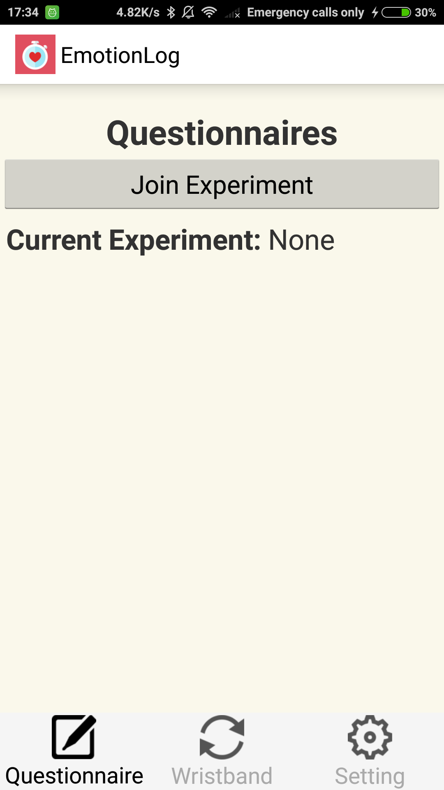
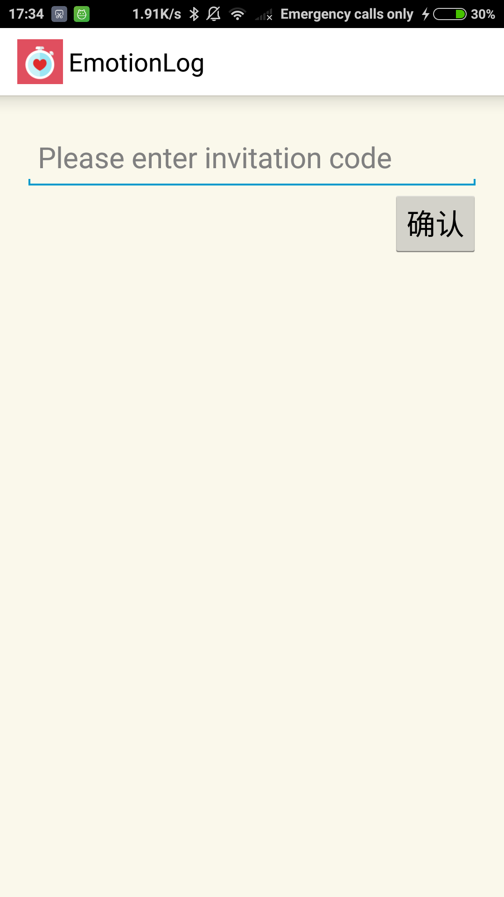
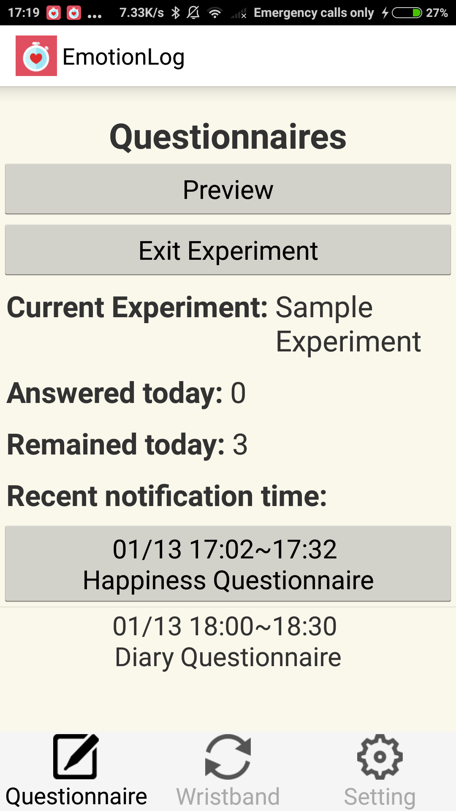
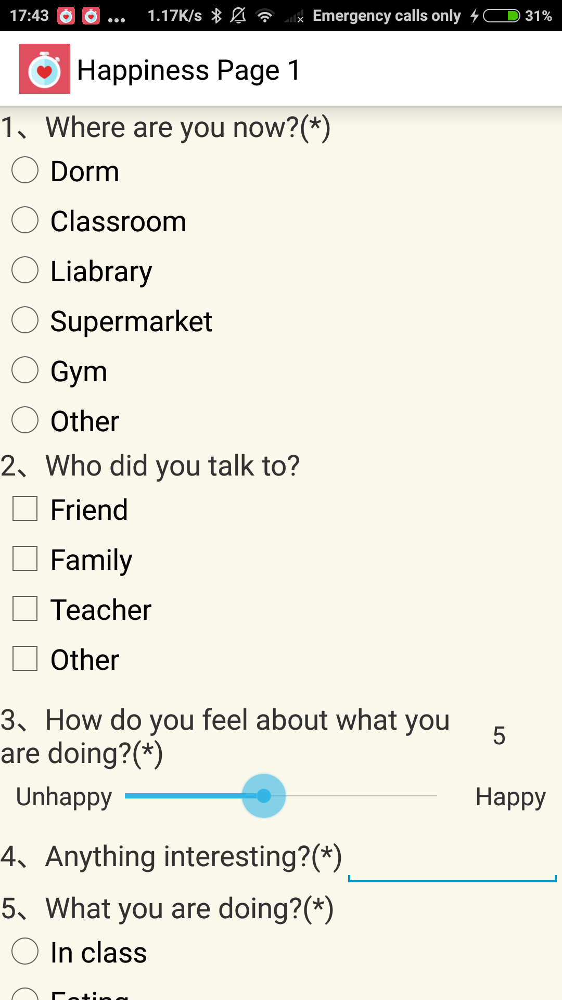
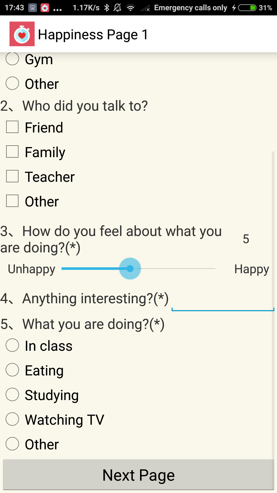
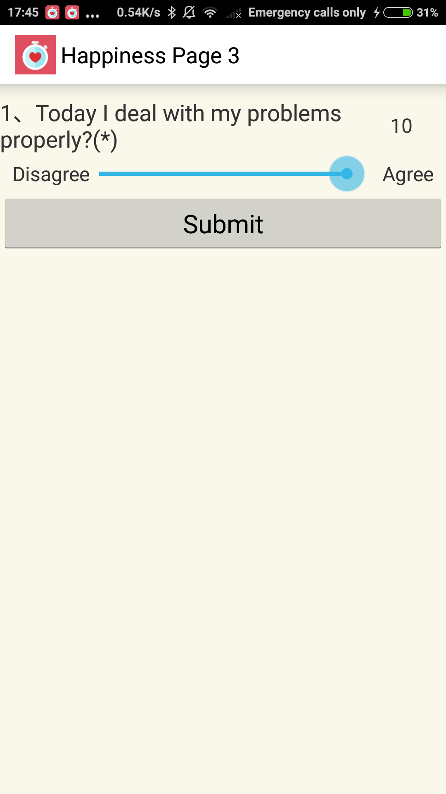
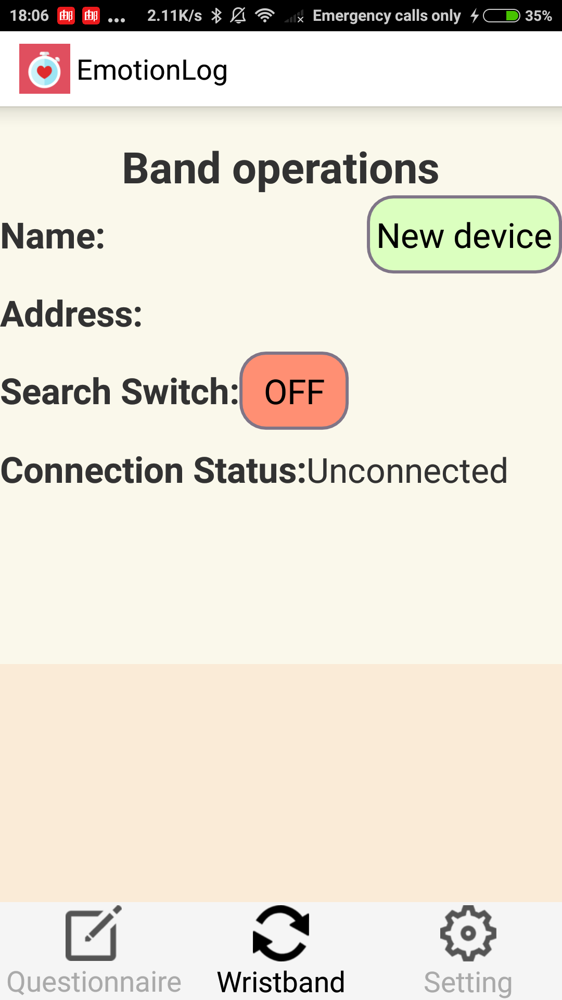
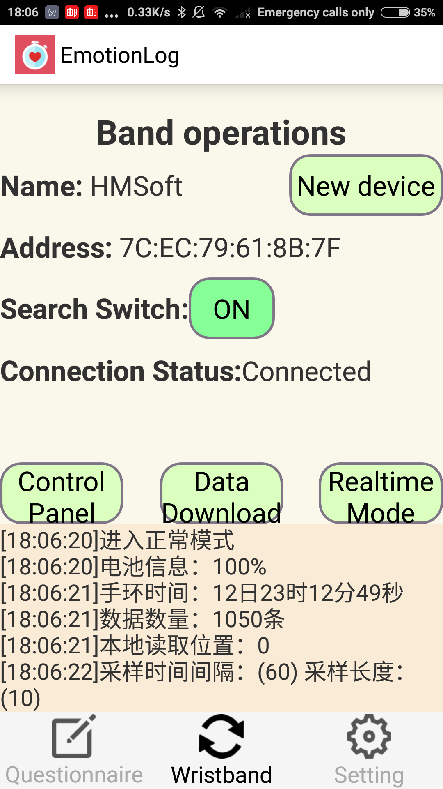
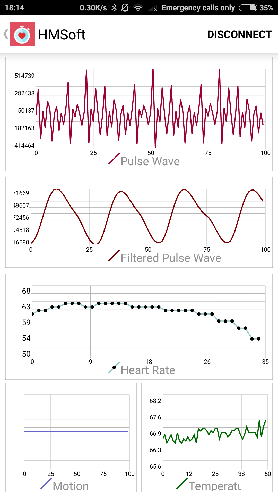

# EmotionLog

### Overview

EmotionLog is part of EmotionLog Suite. For more background information, see [Psychorus Quest](https://github.com/hbisheng/Psychorus-Quest).

### Functions
- Questionnaire module
	1. Join certain experiments by entering the invitation code (provided by the experimenter)
	2. Deliver notifications to the user at the time when the questionnaire should be answered. 
	3. Submit the questionnaire answers to the server.   
- Wristband module
	1. Connect to a customized wristband, download the biological data(heart rate, motion e.g.) of the user, and upload the data to the server.
	2. Configure the wristband.
	3. Show the wristband data in real time.

# Screenshots demo

## Questionnaire Fragment

#### The user will enter the invitation code to join certain experimnet.

## Questionnaire notification

#### Notifications will prompt out when certain questionnaire needs to be answered. 
#### The questionnaire-answer time is set by the experimenter when they configure the experiment.

## Questionnaire answers

#### The interface for anwering questionnaires.
#### Various questionn types are supported, including single choice, multiple choices, range selection, time selection, blank, etc.. 

## WristBand Fragment: Connect

#### In some of the experiments, the participants will also be wearing a customized wristband device. And EmotionLog has provided the interfaces to interact with the wristband.

## Wristband, realtime mode

#### Once connected to the wristband, EmotionLog is able to get the wristband data in realtime and draw dynamic plots to demonstrate it. 

# Copyright
#####The software is currently for internal uses only. 
#####北京汇心心理科技有限公司 版权所有 Copyright © 2015-2017, Psychorus, All Rights Reserved